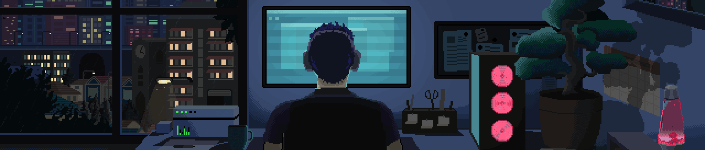

  

# 💎 Djaber Toauti

I'm a **`Frontend Web Developer`** focused on building **modern, responsive, and performance-focused** websites & web apps. Here are some of my personal features:

◈ 📱 **Responsive Design** →   Built to provide a consistent experience across   
 
◈ ⚡ **Performance First** →   Focused on   and efficient rendering.
 
◈ 🎯 **User Experience ( UX )** →   I care about creating a  and  user experience.
 
◈ ✨ **Smooth Interactions** →   I use  to create smooth, purposeful, and modern **`Animations`**.
 
◈ 🧊 **Interactive 3D** →   Step Further, I use   to integrate real and interactive **`3D Models`**.
